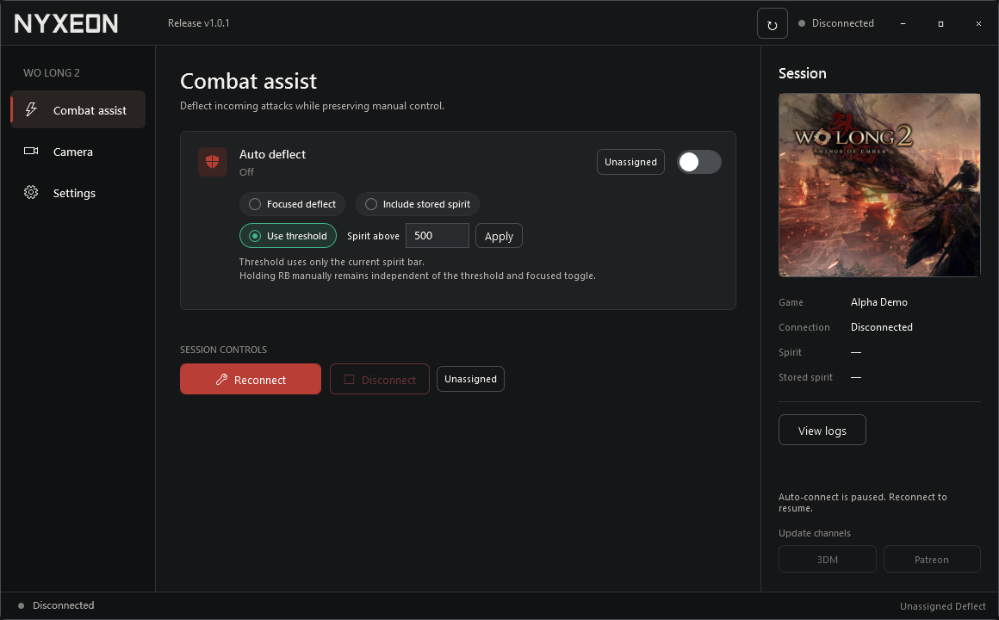

# Wo Long 2: Wings of Ember Trainer

Automatic Deflect, optional spirit-based Focused Deflect, FOV and third-person camera distance controls for the Alpha Demo.

**[Download the latest release](https://github.com/chenzilin100/WoLong2Trainer-Releases/releases/latest)**

Extract the release ZIP and run `WoLong2Trainer.exe`. Start the game and enable the features you want; the trainer connects automatically.

- Every launch starts with features off. Values and custom hotkeys are saved; hotkeys are unassigned by default.
- Focused Deflect has an optional spirit threshold and can include stored spirit. Holding focus manually remains independent of these settings.
- Windows x64, self-contained. English is the default; Simplified Chinese and light/dark themes are available in Settings.

Download the trainer ZIP under **Assets**. GitHub's automatic **Source code** archives contain this download page only.

## 中文

《卧龙2：凤火连天》Alpha Demo 修改器，支持自动化解、按气势阈值自动凝神化解，以及 FOV 和第三人称镜头距离调整。

解压 ZIP 后运行 `WoLong2Trainer.exe`，进入游戏并开启需要的功能即可。程序自动连接，每次启动功能默认关闭；数值和自定义快捷键会保留。可在设置中切换中文。

作者 / Author: Nyxeon (`chenzilin100`)
